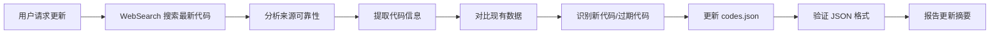

# Hunty Zombies Codes Maintainer Skill

专门用于维护和更新 Hunty Zombies Codes 项目的 Claude skill。

## 🎯 Skill 用途

这个 skill 让 Claude 能够：
1. **自动更新游戏代码** - 从多个来源获取最新 Roblox 游戏代码
2. **管理数据文件** - 维护 `data/codes.json` 的准确性
3. **识别过期代码** - 自动将失效代码移至过期列表
4. **优化网站内容** - 确保用户获得最新、最准确的信息

## 📊 项目结构

```
HuntyZombies/
├── data/codes.json          # 核心数据文件（活跃 + 过期代码）
├── app/page.tsx             # 主页面（显示代码列表）
├── components/
│   ├── CodeCard.tsx         # 活跃代码卡片组件
│   └── ExpiredCodesTable.tsx # 过期代码表格组件
└── CLAUDE.md                # 项目开发指南
```

## 📝 数据结构

### codes.json 格式

```json
{
  "activeCodes": [
    {
      "code": "EXAMPLECODE",
      "reward": "50,000 Coins",
      "addedDate": "2025-11-11"
    }
  ],
  "expiredCodes": [
    {
      "code": "OLDCODE",
      "reward": "10,000 Coins",
      "addedDate": "2025-10-01"
    }
  ]
}
```

**字段说明**:
- `code`: 代码字符串（通常大写字母+数字）
- `reward`: 奖励描述（Coins, Spins, Traits, Tickets 等）
- `addedDate`: 添加日期（YYYY-MM-DD 格式）

## 🌐 代码来源

### 主要数据源（按可靠性排序）

1. **Beebom**
   - URL: https://beebom.com/hunty-zombies-codes/
   - 更新频率: 每天
   - 可靠性: ⭐⭐⭐⭐⭐
   - 特点: 详细的奖励说明、准确的过期状态

2. **Pro Game Guides**
   - URL: https://progameguides.com/roblox/hunty-zombies-codes/
   - 更新频率: 每天
   - 可靠性: ⭐⭐⭐⭐⭐
   - 特点: 及时更新、社区验证

3. **Pocket Tactics**
   - URL: https://www.pockettactics.com/hunty-zombie-codes
   - 更新频率: 每 2-3 天
   - 可靠性: ⭐⭐⭐⭐
   - 特点: 移动优化、简洁列表

4. **Destructoid**
   - URL: https://www.destructoid.com/hunty-zombies-codes/
   - 更新频率: 每周
   - 可靠性: ⭐⭐⭐⭐
   - 特点: 详细攻略、历史记录

5. **Dexerto**
   - URL: https://www.dexerto.com/roblox/hunty-zombie-codes-october-2025-3266973/
   - 更新频率: 每月更新
   - 可靠性: ⭐⭐⭐
   - 特点: 综合报道

### 官方来源

- **Hunty Zombies Discord**: 新代码首发地
- **Roblox 游戏页面**: 官方公告
- **开发者 Twitter/X**: 特殊活动代码

## 🔄 更新工作流程

### 标准更新流程



### Step 1: 搜索最新代码

**搜索查询示例**:
```
"Hunty Zombies codes November 2025 working latest"
"Hunty Zombies Roblox codes active"
"Hunty Zombies new codes 2025"
```

**WebSearch 参数**:
```json
{
  "query": "Hunty Zombies codes [当前月份] 2025 working latest",
  "time_range": "recent",
  "num_results": 10
}
```

### Step 2: 提取代码信息

**识别模式**:
- 代码格式: 通常为大写字母+数字（如 `HBDPFRESH`, `Reaper`, `RIP67`）
- 代码长度: 3-20 个字符
- 奖励关键词: `Coins`, `Spins`, `Traits`, `Tickets`, `Rerolls`

**提取模板**:
```json
{
  "code": "[从网页提取的代码]",
  "reward": "[从网页提取的奖励]",
  "addedDate": "[今天日期 YYYY-MM-DD]"
}
```

### Step 3: 数据对比与更新

**对比逻辑**:
1. 读取当前 `data/codes.json`
2. 比对新发现的代码与现有代码
3. 分类:
   - **新代码**: 不在 `activeCodes` 或 `expiredCodes` 中
   - **仍然有效**: 在多个来源中都出现
   - **可能过期**: 只在旧文章中出现，新文章未提及

**更新规则**:
- ✅ 新代码 → 添加到 `activeCodes` 顶部
- ⏰ 过期代码 → 从 `activeCodes` 移到 `expiredCodes` 顶部
- 📅 保持按 `addedDate` 降序排列（最新的在前）
- 🔒 保留 `addedDate`（不修改原始添加日期）

### Step 4: 验证与保存

**验证检查**:
- ✅ JSON 格式正确
- ✅ 所有字段都存在
- ✅ 日期格式正确（YYYY-MM-DD）
- ✅ 无重复代码
- ✅ 代码名称有效（无特殊字符）

**保存步骤**:
1. 使用 Edit 或 Write 工具更新 `data/codes.json`
2. 确保格式化（2 空格缩进）
3. 保留文件结构完整性

## 🤖 使用示例

### 示例 1: 完整更新流程

**用户请求**:
> "更新 Hunty Zombies 的游戏代码"

**Skill 执行**:
1. 使用 WebSearch 查询最新代码
2. 分析前 5 个搜索结果
3. 提取所有提到的代码
4. 读取 `data/codes.json`
5. 对比并识别变化
6. 更新文件
7. 报告:
   ```
   📊 更新摘要:
   🆕 新增代码: 3
     • Reaper → 5 Lucky Spins
     • ScytheRP → 50,000 Coins
     • RIP67 → 10 Traits

   ⏰ 过期代码: 2
     • HBDPFRESH
     • Raidmodehaha

   ✅ 当前活跃: 7 个
   🗄️ 历史过期: 40 个
   ```

### 示例 2: 快速检查

**用户请求**:
> "检查是否有新代码"

**Skill 执行**:
1. 快速 WebSearch（限制 3 个结果）
2. 提取代码名称
3. 对比现有列表
4. 报告发现的新代码（如果有）

### 示例 3: 手动添加代码

**用户请求**:
> "添加代码 NEWCODE2024，奖励 100,000 Coins"

**Skill 执行**:
1. 验证代码格式
2. 检查是否已存在
3. 添加到 `activeCodes`
4. 使用今天日期
5. 保存并确认

## 📋 任务清单

### 常规维护任务

- [ ] **每日任务**: 检查新代码（使用 WebSearch）
- [ ] **每周任务**: 验证所有活跃代码仍然有效
- [ ] **每月任务**: 清理过期代码列表，保留最近 3 个月的

### 数据质量检查

- [ ] 所有 `activeCodes` 都有准确的 `reward`
- [ ] 日期格式统一（YYYY-MM-DD）
- [ ] 无重复条目
- [ ] 按日期排序正确

## 🛠️ 工具使用指南

### 必需工具

1. **WebSearch** - 查找最新代码信息
   ```
   用途: 搜索 Beebom、Pro Game Guides 等网站
   查询: "Hunty Zombies codes [月份] 2025 working"
   ```

2. **Read** - 读取现有数据
   ```
   文件: data/codes.json
   用途: 获取当前代码列表
   ```

3. **Edit/Write** - 更新数据
   ```
   文件: data/codes.json
   操作: 添加新代码、移动过期代码
   ```

### 可选工具

4. **WebFetch** - 获取特定页面内容（深度分析）
5. **Grep** - 搜索项目中的代码引用

## 🚨 注意事项

### 数据准确性

- ⚠️ 优先使用多个来源验证
- ⚠️ 新代码发布 24 小时内可能不稳定
- ⚠️ 特殊活动代码通常有时间限制
- ⚠️ 区分大小写（某些代码混合大小写）

### 文件操作

- 🔒 始终先读取文件再修改
- 🔒 保持 JSON 格式正确
- 🔒 保留原始 `addedDate`
- 🔒 使用 2 空格缩进

### 用户体验

- 📊 提供清晰的更新摘要
- 📊 说明新代码来源
- 📊 标注不确定的信息
- 📊 建议用户验证新代码

## 📈 性能指标

### 目标 KPI

- **准确率**: >95% (代码可用性)
- **更新频率**: 每日检查
- **响应时间**: <2 分钟（完整更新流程）
- **数据完整性**: 100% (JSON 有效性)

### 质量标准

- ✅ 所有活跃代码都经过多源验证
- ✅ 奖励信息准确完整
- ✅ 过期代码及时移除
- ✅ 数据格式规范统一

## 🔗 相关资源

- **项目开发指南**: `CLAUDE.md`
- **Next.js 文档**: https://nextjs.org/docs
- **Hunty Zombies Wiki**: (社区维护)
- **Roblox 官方**: https://www.roblox.com

## 📞 故障排除

### 问题 1: WebSearch 找不到新代码

**解决方案**:
- 尝试不同的搜索关键词
- 检查月份是否正确
- 访问 Discord 官方频道
- 手动浏览 Beebom 网站

### 问题 2: 代码格式不一致

**解决方案**:
- 统一使用原始大小写格式
- 去除多余空格
- 验证字符长度（3-20）

### 问题 3: JSON 保存失败

**解决方案**:
- 检查 JSON 语法
- 确保引号配对
- 验证逗号位置
- 使用 JSON 验证工具

---

**Skill 版本**: 1.0.0
**最后更新**: 2025-11-11
**维护者**: huntyZombies
